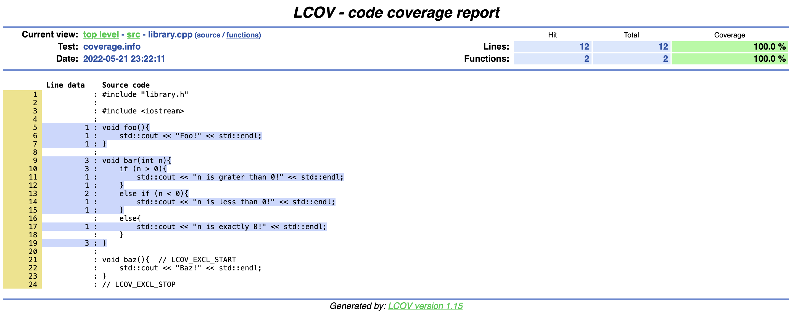

# `CMake` + `GoogleTest` +  `gcov`

This little repo should contain everything you need to know if you want to:
- Structure a C++ project with `CMake`.
- Run tests for your code through `GoogleTest`.
- Check code coverage by means of `gcov`.

As an example, the file `build-and-run-cov.sh` will:
- Build your code with `coverage`flags (`-fprofile-arcs -ftest-coverage
  `).
- Run all the tests.
- Show `coverage` information.

In this case our code consists of a simple shared library.

`library.cpp`
```
#include "library.h"

#include <iostream>

void foo(){
    std::cout << "Foo!" << std::endl;
}

void bar(int n){
    if (n > 0){
        std::cout << "n is grater than 0!" << std::endl;
    }
    else if (n < 0){
        std::cout << "n is less than 0!" << std::endl;
    }
    else{
        stad::cout << "n is exactly 0!" << std::endl;
    }
}

void baz(){  // LCOV_EXCL_START
    std::cout << "Baz!" << std::endl;
}
// LCOV_EXCL_STOP

```

And our tests are:

`test_library.h`

```
#include "../src/library.h"

#include <gtest/gtest.h>


namespace gcov_tutorial::tests {
    TEST(TestFooSuite,TestFoo){
        foo();
    }
    TEST(TestBarSuite,TestBarGreaterThanZero){
        bar(100);
    }
    TEST(TestBarSuite,TestBarEqualToZero){
        bar(0);
    }
    TEST(TestBarSuite,TestBarLessThanZero){
        bar(-100);
    }
}
```

The generated `lcov` report will be:




## Compiling with GCC
### On Ubuntu
Just run
```
./build-and-run-cov.sh
```
### On MacOs:
You can install `gcc` with `home-brew` by running `brew install gcc`.

Then you just have to specify the environment variables `CC`, `CXX`, and `GCOV` before building.
```
CC=/usr/local/bin/gcc-11 CXX=/usr/local/bin/g++-11 GCOV=/usr/local/bin/gcov-11 ./build-and-run-cov.sh
```
(Check your `gcc`version under `/usr/local/bin/` first)

## Compiling with CLang
### On MacOs
The default compiler on MacOs is `AppleClang` (even if you try to use the `gcc` command it will actually run `clang`, see [here](https://stackoverflow.com/questions/64992467/mac-clang-installation-seems-to-override-gcc-install) or just run `gcc --version` for confirmation)

The default options will work just fine:
```
./build-and-run-cov.sh
```

### On Ubuntu
You can install `CLang` by following [these](https://apt.llvm.org) instructions.
As explained in the `GCC` section, you just have to specify the `CC`, `CXX`, and `GCOV` variables.
```
$ CC=clang-13 CXX=clang++-13 GCOV=$PWD/llvm-cov-13.sh ./build-and-run-cov.sh
```
Where `llvm-cov-13.sh` is a wrapper for `llvm-cov-13` for compatibility with the `--gcov-tool` flag (see [this](https://stackoverflow.com/a/58118318/2137996) for more detail).
```
#!/bin/bash
exec llvm-cov-13 gcov "$@"
```
Note: don't forget to make the file executable! (`chmod 755 llvm-cov-13.sh`
)


## Compiling on Windows
`... one day ...`